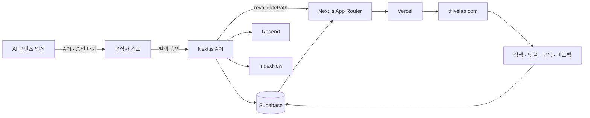

<div align="center">

# Nodelog

### AI 초안에 사람의 검토를 더한 실전 IT 테크 미디어

개발 · 인프라 · 보안 · AI 자동화의 복잡한 기술 정보를<br>
공식 문서와 실무 관점으로 정리해 전달합니다.

[](https://www.thivelab.com)
[](https://nextjs.org)
[](https://react.dev)
[](https://supabase.com)
[](https://vercel.com)

[사이트 방문](https://www.thivelab.com) ·
[전체 글](https://www.thivelab.com/blog) ·
[엔지니어 가이드](https://www.thivelab.com/engineer) ·
[시리즈](https://www.thivelab.com/series) ·
[RSS](https://www.thivelab.com/rss)

</div>

---

## 프로젝트 소개

Nodelog는 IT·개발·보안 실무자를 위한 한국어 기술 미디어입니다. AI 에이전트가 공식 문서와 1차 기술 자료를 바탕으로 초안을 만들고, 사람 편집자가 사실관계·재현 가능성·실무 적용성을 검토한 뒤 발행합니다.

이 저장소에는 [thivelab.com](https://www.thivelab.com)의 프론트엔드, 콘텐츠 API, 검색, 댓글, 뉴스레터, SEO 및 운영 자동화 코드가 들어 있습니다.

### 다루는 영역

| 영역 | 주요 주제 |
| --- | --- |
| AI·자동화 | LLM, RAG, 에이전트, 프롬프트, AI 거버넌스 |
| 개발 | JavaScript·TypeScript, Python, Java, Git, CI/CD |
| 인프라·DevOps | Linux, Docker, Kubernetes, Cloud, systemd |
| 보안 | 서버 보안, 취약점 진단, 네트워크, 컴플라이언스 |
| 데이터·네트워크 | PostgreSQL, MySQL, 연결 풀링, 장애 진단 |
| 도구·리뷰 | 개발 도구 비교, 도입 기준, 운영 비용 분석 |

## 주요 기능

- **콘텐츠 허브** — 블로그, 엔지니어 가이드, 시리즈, 카테고리와 태그 탐색
- **실시간 검색** — 글과 엔지니어 가이드를 통합 검색하고 관련도순 정렬
- **개인화 탐색** — 트렌딩, 추천, 북마크와 읽던 위치 저장
- **읽기 경험** — 목차, 진행률, 코드 블록 복사, 관련 글과 이전·다음 글
- **커뮤니티** — 익명 댓글·답글, 댓글 좋아요, 글 도움 여부 피드백
- **뉴스레터** — 구독·해지, 환영 메일과 뉴스레터 발송
- **콘텐츠 API** — 인증된 AI 에이전트의 초안 생성·수정·발행
- **중복 방지** — 제목 유사도 검사로 검색 카니벌라이제이션 위험 글 보류
- **SEO 자동화** — Metadata, canonical, JSON-LD, sitemap, robots, RSS, IndexNow
- **ISR** — 주요 목록과 상세 페이지를 주기적으로 재생성하고 발행 시 즉시 무효화
- **동적 OG 이미지** — 글과 가이드별 Open Graph 이미지 자동 생성
- **품질 운영 도구** — 콘텐츠 품질, 출처, 중복, 내부 링크와 전체 URL 크롤 감사

## 시스템 구성



### 기술 스택

| 구분 | 기술 | 역할 |
| --- | --- | --- |
| Framework | Next.js 16 App Router | 페이지, Route Handler, ISR, Metadata |
| UI | React 19, TypeScript | 서버·클라이언트 컴포넌트 |
| Styling | CSS, Tailwind CSS 4 toolchain | 반응형 UI와 디자인 토큰 |
| Content | React Markdown, remark-gfm | Markdown 본문과 GFM 렌더링 |
| Database | Supabase PostgreSQL | 글, 가이드, 댓글, 구독자, 문의 |
| Email | Resend | 구독 환영 메일, 뉴스레터, 문의 알림 |
| Hosting | Vercel | 빌드, 배포, Cron, Analytics |
| Search/SEO | Supabase Search, IndexNow | 사이트 검색과 검색엔진 갱신 |

## 시작하기

### 요구 사항

- Node.js 20 이상
- npm
- Supabase 프로젝트
- 선택 사항: Resend API 키

### 설치 및 실행

```bash
git clone git@github.com:SecuThive/ai_blog.git
cd ai_blog
npm install
# 아래 환경 변수 표를 참고해 .env.local 구성
npm run dev
```

개발 서버는 기본적으로 [http://localhost:3000](http://localhost:3000)에서 실행됩니다.

아래 환경 변수 표를 참고해 `.env.local`을 구성하세요. 실제 키는 Git에 커밋하지 않습니다.

### 환경 변수

#### 필수

| 변수 | 설명 |
| --- | --- |
| `NEXT_PUBLIC_SITE_URL` | canonical과 OG URL에 사용할 사이트 주소 |
| `SUPABASE_URL` | Supabase 프로젝트 URL |
| `SUPABASE_ANON_KEY` | 공개 읽기용 Supabase anon key |
| `SUPABASE_SERVICE_ROLE_KEY` | 서버 API의 쓰기 작업용 service role key |
| `BLOG_API_KEY` | 글 생성·수정·재검증 API 인증 키 |

#### 기능별 선택

| 변수 | 설명 |
| --- | --- |
| `RESEND_API_KEY` | 구독·문의·뉴스레터 이메일 발송 |
| `NEWSLETTER_API_KEY` | 뉴스레터 발송 엔드포인트 인증 |
| `INDEXNOW_SECRET` | 수동 IndexNow 제출 보호 |
| `CRON_SECRET` | Vercel Cron 요청 검증 |
| `NEXT_PUBLIC_ADSENSE_ID` | Google AdSense 게시자 ID |
| `NEXT_PUBLIC_ADSENSE_APPROVED` | 광고 스크립트 활성화 플래그 |
| `GOOGLE_SITE_VERIFICATION` | Google 사이트 소유권 확인 |
| `NAVER_SITE_VERIFICATION` | Naver 사이트 소유권 확인 |
| `GSC_SERVICE_ACCOUNT_JSON` | 운영 스크립트의 Search Console 인증 |
| `GSC_SITE_URL` | Search Console 속성 주소 |

서버 전용 키에는 `NEXT_PUBLIC_` 접두사를 붙이지 마세요. 특히 `SUPABASE_SERVICE_ROLE_KEY`, `BLOG_API_KEY`, 이메일 API 키는 브라우저에 노출되면 안 됩니다.

## 개발 명령어

```bash
npm run dev      # Turbopack 개발 서버
npm run lint     # ESLint 정적 검사
npm run build    # 프로덕션 빌드와 타입 검사
npm start        # 빌드 결과를 프로덕션 모드로 실행
```

변경 사항을 배포하기 전 최소 검증:

```bash
npm run lint
npm run build
```

## 프로젝트 구조

```text
ai-blog/
├── src/
│   ├── app/
│   │   ├── blog/[slug]/       # 블로그 상세·메타데이터·OG 이미지
│   │   ├── engineer/[slug]/   # 엔지니어 가이드 상세
│   │   ├── api/               # 글·검색·댓글·구독·재검증 API
│   │   ├── category/          # 카테고리별 탐색
│   │   ├── tag/               # 태그별 탐색
│   │   ├── series/            # 연재형 콘텐츠
│   │   ├── sitemap.ts         # 동적 사이트맵
│   │   ├── robots.ts          # 검색봇 정책
│   │   └── rss/               # RSS 피드
│   ├── components/            # 공통 UI와 클라이언트 상호작용
│   └── lib/                   # Supabase, 타입, 리다이렉트, SEO 유틸
├── scripts/                   # 생성·감사·정리·리프레시 자동화
├── docs/                      # 콘텐츠 템플릿과 SEO 운영 문서
├── public/                    # 정적 파일, llms.txt, IndexNow 키
├── supabase-schema.sql        # 핵심 데이터베이스 스키마
├── comments-schema.sql        # 댓글 스키마
├── next.config.ts             # Next.js 설정과 피드 리다이렉트
└── vercel.json                # Vercel Cron 설정
```

## 데이터 모델

핵심 스키마는 [supabase-schema.sql](./supabase-schema.sql)과 [comments-schema.sql](./comments-schema.sql)에 정의되어 있습니다.

| 테이블 | 용도 |
| --- | --- |
| `posts` | 블로그 글, 상태, 태그, 조회수와 발행 정보 |
| `engineer_guides` | 난이도·OS 호환성을 포함한 실무 가이드 |
| `comments` | 승인 상태를 가진 댓글과 답글 |
| `comment_likes` | 댓글·IP 해시 기준 중복 좋아요 방지 |
| `subscribers` | 뉴스레터 구독 상태 |
| `contact_messages` | 문의 폼 메시지 |

공개 사용자는 RLS 정책을 통해 발행된 콘텐츠만 읽을 수 있습니다. 데이터 변경은 서버 Route Handler에서 service role로 수행합니다.

### 초기 스키마 적용

Supabase SQL Editor에서 다음 순서로 실행합니다.

1. `supabase-schema.sql`
2. `comments-schema.sql`
3. 필요한 추가 마이그레이션 파일

운영 DB에 적용하기 전 SQL 내용과 기존 스키마 차이를 반드시 확인하세요.

## API 개요

| Method | Endpoint | 설명 | 인증 |
| --- | --- | --- | --- |
| `GET` | `/api/posts` | 발행 글 페이지네이션 조회 | 공개 |
| `POST` | `/api/posts` | 글 생성 및 중복 검사 | `x-api-key` |
| `GET` | `/api/posts/[id]` | ID 또는 slug로 글 조회 | 공개 |
| `PUT` | `/api/posts/[id]` | 글 수정·발행 | `x-api-key` |
| `DELETE` | `/api/posts/[id]` | 글 삭제 | `x-api-key` |
| `GET` | `/api/search?q=` | 글·가이드 통합 검색 | 공개 |
| `GET/POST` | `/api/comments` | 댓글 조회·등록 | 공개·rate limit |
| `POST` | `/api/comments/like` | 댓글 좋아요 | 공개·IP 멱등 |
| `POST` | `/api/feedback` | 글 도움 여부 기록 | 공개 |
| `POST` | `/api/subscribe` | 뉴스레터 구독 | 공개 |
| `GET` | `/api/unsubscribe` | 뉴스레터 구독 해지 | 공개 |
| `POST` | `/api/contact` | 문의 저장·알림 | 공개 |
| `POST` | `/api/revalidate` | 관련 페이지 캐시 갱신 | `x-api-key` |
| `GET/POST` | `/api/indexnow` | 검색엔진 URL 제출 | Secret/Cron |

### 발행 예시

```bash
curl -X POST https://www.thivelab.com/api/posts \
  -H "Content-Type: application/json" \
  -H "x-api-key: $BLOG_API_KEY" \
  -d '{
    "title": "새 글 제목",
    "content": "## 시작하기\n\nMarkdown 본문",
    "excerpt": "검색 결과와 카드에 표시할 요약",
    "category": "개발",
    "tags": ["Next.js", "TypeScript"],
    "status": "draft"
  }'
```

API는 본문 최상위 제목과 태그를 정규화합니다. 유사한 기존 제목이 발견되면 즉시 중복 발행하지 않고 검토 가능한 초안으로 보류합니다.

## 콘텐츠 발행 흐름

```text
주제 선정
  → 기존 콘텐츠·검색 의도 확인
  → AI 초안 생성
  → 출처·명령어·버전·안전성 검토
  → 중복 및 카니벌라이제이션 검사
  → 편집자 승인
  → Supabase 발행
  → Next.js 캐시 재검증
  → Sitemap·RSS·IndexNow 갱신
```

콘텐츠 작성 형식은 [docs/CONTENT_TEMPLATE.md](./docs/CONTENT_TEMPLATE.md), 운영 원칙은 사이트의 [편집 정책](https://www.thivelab.com/policy)을 따릅니다.

### 편집 원칙

- 공식 문서·표준·공급사 문서 등 1차 출처를 우선합니다.
- 명령어와 설정은 독자가 복사하기 전에 전제 조건과 위험을 알 수 있어야 합니다.
- AI 초안은 사람 편집자의 사실 확인과 실무 검토를 거칩니다.
- 제목만 다른 중복 콘텐츠를 발행하지 않습니다.
- 정보가 바뀌면 새 글을 양산하기보다 기존 글을 갱신합니다.
- 삭제·통합된 URL은 가능한 경우 영구 리다이렉트로 검색 가치를 보존합니다.

## 렌더링과 캐시

- 홈, 글 상세, 가이드, 카테고리, 태그와 시리즈는 ISR을 사용합니다.
- 글·가이드 상세의 기본 재검증 주기는 60초입니다.
- 새 콘텐츠 발행 또는 수정 시 `/api/revalidate`가 관련 목록과 상세 경로를 갱신합니다.
- sitemap은 최신 DB 상태를 반영하기 위해 동적으로 생성합니다.
- RSS는 1시간, 상세 OG 이미지는 1일 단위로 재검증합니다.

콘텐츠가 DB에는 있지만 프로덕션에서 오래된 페이지나 오류가 보이면 다음 순서로 확인합니다.

1. `/api/revalidate` 호출
2. 해당 URL의 HTTP 상태와 Vercel 로그 확인
3. `npm run build`로 로컬 프로덕션 재현
4. 오래된 배포 캐시가 의심되면 Vercel production 재배포

## SEO와 품질 관리

Nodelog는 다음 정보를 코드에서 자동 생성합니다.

- 페이지별 title, description, canonical
- Article 또는 TechArticle JSON-LD
- 동적 Open Graph 이미지
- `sitemap.xml`, `robots.txt`, RSS
- 카테고리·태그·시리즈 내부 링크
- 삭제·통합 글의 영구 리다이렉트
- 품질 보강 대상 글의 선택적 `noindex`

주요 감사 도구:

```bash
node scripts/audit-crawl.mjs          # 전체 URL·canonical·H1·내부 링크 검사
node scripts/audit-content-body.mjs   # 본문 구조와 결함 검사
node scripts/audit-adsense.mjs        # AdSense 품질 신호 검사
node scripts/audit-cannibalization.mjs
node scripts/score-content-quality.mjs
```

일부 스크립트는 운영 Supabase 데이터를 변경합니다. 파일 상단의 설명과 dry-run 지원 여부를 확인한 뒤 실행하세요.

## 배포

`main` 브랜치에 반영된 커밋은 GitHub–Vercel 연동을 통해 프로덕션으로 배포됩니다.

```text
GitHub main
  → Vercel Build
  → TypeScript / Next.js production build
  → Production Deployment
  → thivelab.com
```

배포 후 권장 확인 항목:

- 홈, 최신 글, 글 상세와 엔지니어 가이드가 `200`인지
- `/sitemap.xml`, `/robots.txt`, `/rss`가 정상인지
- canonical이 실제 요청 URL과 일치하는지
- Vercel Functions에 새 오류가 없는지
- 새 글 발행 후 ISR이 갱신되는지

## 보안

- 비밀 키와 service role key를 저장소에 커밋하지 않습니다.
- 쓰기 API는 `x-api-key`, Cron secret 등 서버 측 인증을 사용합니다.
- 공개 데이터는 Supabase RLS로 발행 상태만 조회할 수 있게 제한합니다.
- 댓글은 IP 원문 대신 salt가 포함된 해시를 저장하고 요청 빈도를 제한합니다.
- 외부 입력은 길이·형식·허용 호스트를 검사한 뒤 처리합니다.

보안 문제를 발견했다면 공개 이슈 대신 [문의 페이지](https://www.thivelab.com/contact)를 이용해 주세요.

## 참고 링크

- [Nodelog 홈](https://www.thivelab.com)
- [서비스 소개](https://www.thivelab.com/about)
- [편집 정책](https://www.thivelab.com/policy)
- [FAQ](https://www.thivelab.com/faq)
- [문의](https://www.thivelab.com/contact)
- [RSS 피드](https://www.thivelab.com/rss)

---

<div align="center">

**NODELOG · AI DRAFT, HUMAN REVIEW**

정보의 양보다 맥락의 밀도를 높입니다.

</div>
